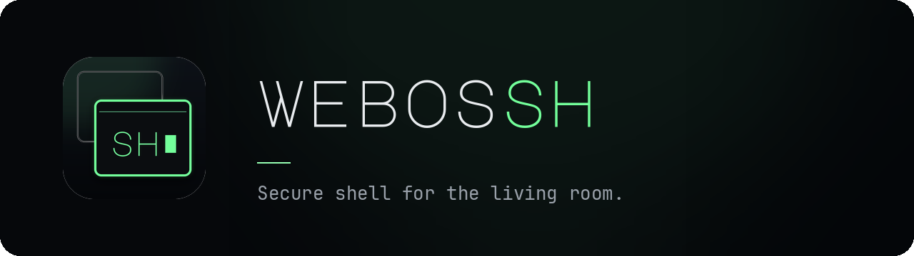
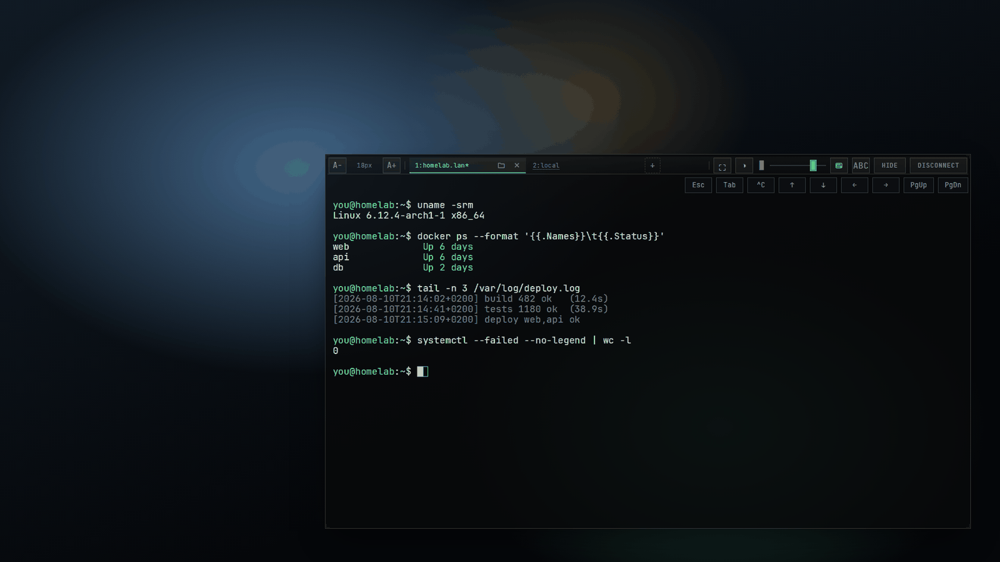
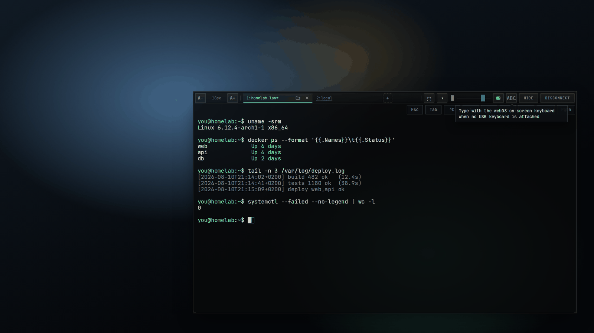
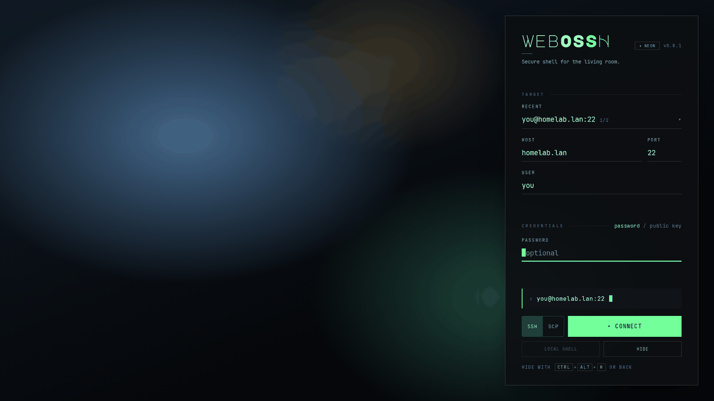

<p align="center">
  
</p>

<p align="center">
  An SSH client that runs <b>on your LG TV</b> — as an overlay above whatever is already on screen.
</p>

<p align="center">
  
  
  <a href="https://github.com/sh00bx/webos-ssh-client/releases/latest"></a>
</p>

<p align="center">
  
</p>

---

I kept looking for a usable SSH client that could run directly on my TV, ideally
as an overlay above whatever was already on screen. I could not find one, so I
vibe coded this project into existence.

The app opens a terminal panel above the current app or input; a background
Node.js service keeps the SSH sessions alive while the overlay is hidden, so
hiding it with Back and coming back later drops you into the same shell, with
the last screenful replayed.

Tested target: LG G4 OLED, webOS 25, with and without a USB keyboard.

## Install

On a rooted TV, add this repository once in **Homebrew Channel → Settings → Add
Repository**:

```
https://raw.githubusercontent.com/sh00bx/webos-apps/main/repo.json
```

**webossh** then appears in the app list and installs and updates from there.
Nothing else to do — the two root helpers it needs travel inside the package and
install themselves on first start.

That URL is my [app channel](https://github.com/sh00bx/webos-apps): one
repository for all of my webOS apps, so adding it once also brings anything else
published there.

## What it does

|  |  |
| --- | --- |
| **Overlay, not takeover** | The panel floats above YouTube, an HDMI input or a game. Move it, resize it from any edge or corner, make it translucent, or push it full screen. |
| **A real terminal** | xterm.js with a WebGL renderer, scrollback and search, mouse reporting, and correct `Esc`/`Ctrl` handling for vim, less and tmux. |
| **Sessions outlive the window** | Hide the overlay (Back, or `Ctrl+Alt+H`) and the session keeps running. Relaunch to reattach; several sessions live side by side as tabs. |
| **Files on the same connection** | The SCP tab is a second channel on the session you already opened — no second login — with streamed transfers both ways. |
| **A local root shell on the TV** | `Ctrl+Alt+L`, same window, same tabs, no network involved. |
| **Password and key auth** | ed25519 and RSA; host keys are pinned on first connect, and the app says so when one changes. |
| **Built for a remote** | Every control is reachable with the D-pad, the key bar sends what a remote cannot (`Esc`, `Tab`, `^C`, PgUp/PgDn), and the webOS on-screen keyboard covers having no USB keyboard. |
| **Themes that react to the picture** | The terminal samples what is behind it and tints itself against it. |

### Tooltips on every control

Hover a button — or land on it with the D-pad — and it says what it does, not
what it is called.

<p align="center">
  
</p>

### The connect panel

<p align="center">
  
</p>

## How it is put together

- **Frontend** — a webOS web app; the terminal is `xterm.js`.
- **Backend** — a webOS Node.js service using `ssh2`, which owns the sessions.
- **Between them** — the Luna bus (`luna://com.pwntastic.sshclient.service`).
- **Root helpers** (`tv-root/`, rooted TVs only) — `backdropd` samples the screen
  for the adaptive themes, `ptyd` provides the pty for the local shell.

Both helpers exist for the same reason: the service runs chrooted as an
unprivileged uid with no capabilities, and from inside that jail neither screen
capture nor `/dev/ptmx` is reachable — a terminal literally cannot be allocated
there. They ship inside the IPK and install themselves on start, using the
Homebrew Channel service to get root for that one step. Everything is compared
before it is copied, so a normal start touches nothing and restarts nothing.

On a TV without Homebrew Channel there is no root path at all: remote SSH still
works, and the local shell says what is missing instead of failing silently.

Anything that can open `ptyd`'s socket gets a root shell, so the socket's owner
is the gate: it is chowned to the app's own uid at mode 0600 inside a 0700
directory, and the kernel does the access control.

## Build it yourself

```bash
npm ci
( cd service && npm ci )
./scripts/build.sh
ares-setup-device --add tv --info '{"name":"tv","host":"<tv-ip>","port":9922,"username":"prisoner"}'
./scripts/install.sh
```

`docs/INSTALL.md` covers Dev Mode and Homebrew Channel in detail,
`docs/DEVELOPMENT.md` the local build setup, and `docs/TROUBLESHOOTING.md`
TV-side diagnostics.

```bash
npm test                         # also node --check over service/service.js + service/lib/**
./scripts/build.sh
./scripts/release.sh --dry-run   # build + Homebrew Channel manifest, publish nothing
python3 scripts/gen-brand.py     # redraw the icons and the banner from the palette
```

The local-shell wire protocol has one more check that `npm test` cannot run (it
needs a C compiler and `/dev/ptmx`), and it is the only place the C encoder in
`tv-root/ptyd.c` and the JS decoder in `service/lib/pty-frames.js` are verified
against each other — run it whenever either changes:

```bash
node tests/ptyd-e2e.manual.mjs   # builds ptyd for the host, drives a real shell
```

On a rooted TV, both halves can be checked without the UI:

```sh
luna-send -n 1 luna://com.pwntastic.sshclient.service/ping '{}'
cat /var/lib/webosbrew/.sshclient-helpers.log   # what the last app start did about the helpers
```

## Shortcuts

| | |
| --- | --- |
| `Ctrl+Alt+H`, Back, **Hide** | Hide the overlay, keep the session running |
| `Ctrl+Alt+Q` / `Ctrl+Alt+X` | Disconnect and return to the connect form |
| `Ctrl+Alt+S` | Detach to the form without disconnecting |
| `Ctrl+Alt+L` | Local root shell on the TV |
| `Ctrl+Alt+D` | In-app debug log |
| `Esc` | Passed through to the session |

On a German layout `Ctrl+Alt` *is* AltGr, which is why the aliases exist: `X`,
`S` and `L` have no third level there and always arrive.

Debug logging is off by default. When enabled, the service writes JSON-lines
logs — without passwords or private keys — to `$HOME/.sshclient/debug.log`.

## Status and caveats

Interactive SSH, SFTP and the local shell all work on the tested TV. Not
implemented: port forwarding, agent forwarding.

A private key you store here stays on the TV. If you store its passphrase with
it, that passphrase is kept in plaintext beside the key — leave it empty to be
asked at connect time instead.

## License

MIT — see `LICENSE`. The bundled fonts (JetBrains Mono, Instrument Serif, Major
Mono Display) are under the SIL Open Font License; see `assets/fonts/`.
